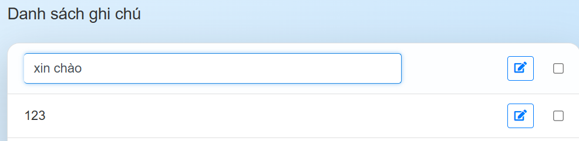

#### User có thể xóa nhiều bài post cùng lúc

- Đầu tiên ta cần chọn ghi chú cần xóa:  
  

- Tiếp theo nhấn vào nút xóa và đây là kết quả:
  

#### Ngoài ra user có thể chỉnh sửa lại ghi chú của mình

- Cụ thể:
  

- Kết quả:
  
